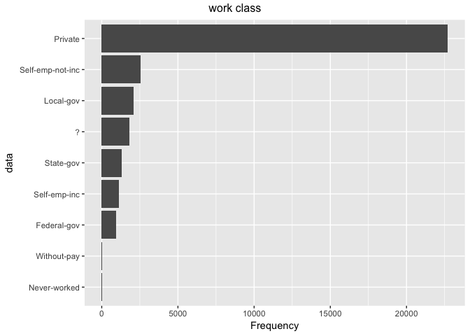
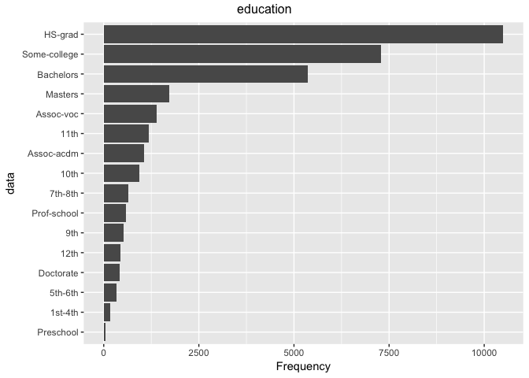
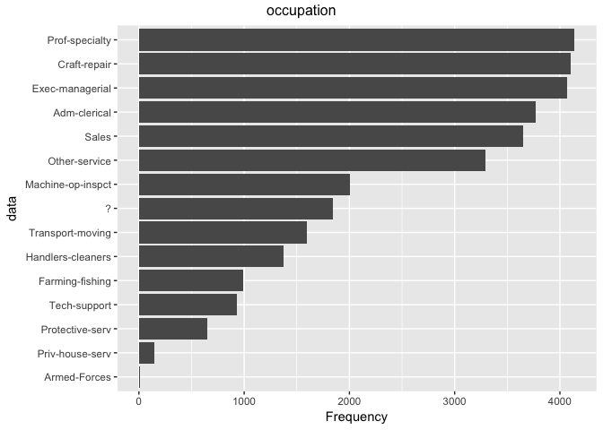
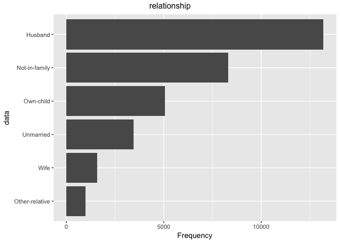
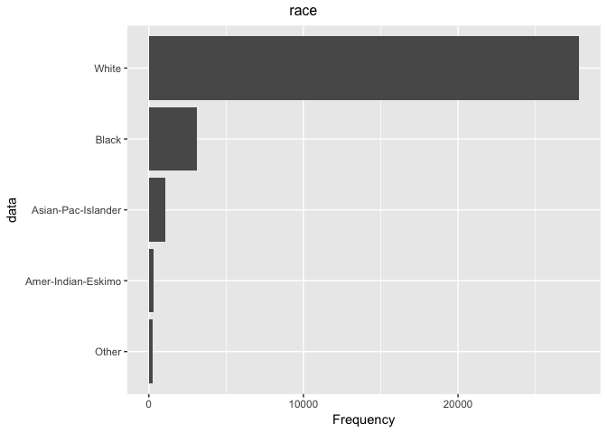
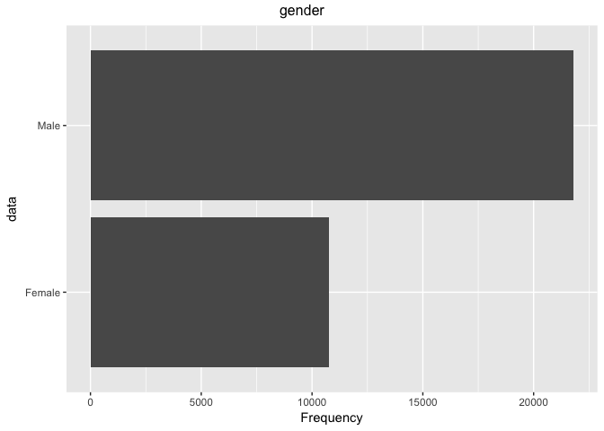
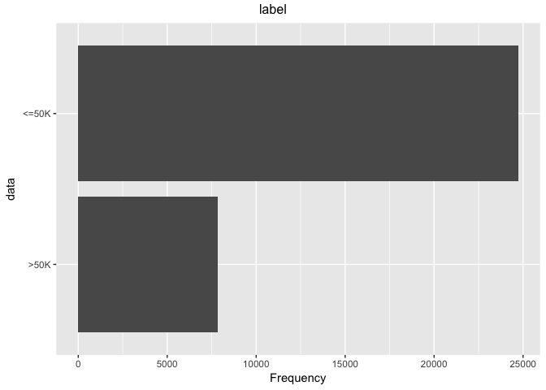
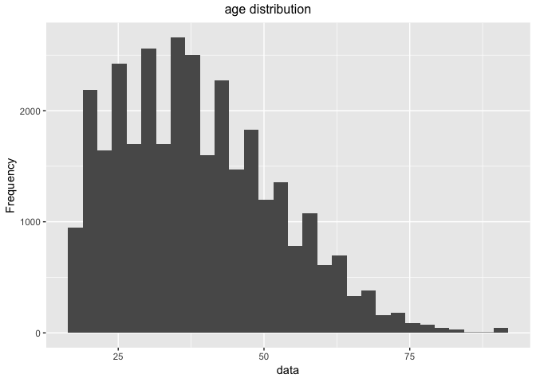
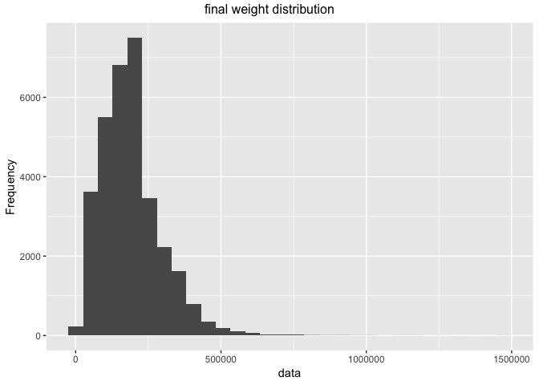

exploratory data analysis
================
Peter
2019-01-02

### Load Dependencies

``` r
library(tidyverse)
```

    ## ── Attaching packages ─────────────────────────────────────────────────────────── tidyverse 1.2.1 ──

    ## ✔ ggplot2 3.0.0     ✔ purrr   0.2.5
    ## ✔ tibble  1.4.2     ✔ dplyr   0.7.6
    ## ✔ tidyr   0.8.1     ✔ stringr 1.3.1
    ## ✔ readr   1.1.1     ✔ forcats 0.3.0

    ## ── Conflicts ────────────────────────────────────────────────────────────── tidyverse_conflicts() ──
    ## ✖ dplyr::filter() masks stats::filter()
    ## ✖ dplyr::lag()    masks stats::lag()

``` r
library(DataExplorer)
```

### Read the data

I will analyse the training data set to learn more about the data
itself.

``` r
train <- read.csv("../../data/adult.data", 
                  header = FALSE,
                  stringsAsFactors = TRUE)

test <- read.csv("../../data/adult.test", 
                  header = FALSE,
                  stringsAsFactors = TRUE)
```

### Data cleaning

``` r
# add column names into the data frame

column_name_string <- c("age", "workclass", "fnlwgt", 
                        "education", "education_num", "marital_stat", 
                        "occupation", "relationship", "race", "sex", 
                        "capital_gain", "capital_loss", "hr_per_wk", 
                        "native_country", "label")

# ref: https://stackoverflow.com/questions/6081439/changing-column-names-of-a-data-frame
colnames(train) <- column_name_string
colnames(test) <- column_name_string
```

### Exploratory Data Analysis

*Examine the variables*

I try not to look at any pre-exisitng tutorials so I am not biased
towards any particular analysis approach. However, the variable `fnlwgt`
was not explained by the original data source so I did a quick google
search. I found a short answer on Quora (link:
<https://www.quora.com/What-is-the-meaning-of-capital-gain-capital-loss-and-fnlwgt-in-adult-dataset-from-UCI>).
`fnlwgt` means sampling weight.

A tutorial by Statistical Consulting Group of
(<http://scg.sdsu.edu/dataset-adult_r/>) on this data set suggested
ignoring the `fnlwgt` variable because it clutters the analysis.
`fnlwgt` represents the number of people the census takers believe that
observation represents. This sampling weight also seems unnecessary for
the purpose of my analysis because my analysis is a proof of concept.
This data set may also be too small to make a proper inference of the
whole US population.

Secondly, some variables seem to be highly correlated. level of
education `education` and years of eduation `education_num` pretty much
represent the same idea. `relationship` and `marital_status` are also
highly correlated. The statistical consulting group also points out that
`relationship` contains family relationship values such husband, father,
and so on, but it only contains one per observation. Some information is
missing from this `relationship` variable because a person can have
multiple relationships if it is a big family in the household. Also,
having too many features may result in a overfitted classifier. I am
attempted to remove `education_num` and `relationship`. (ref:
<https://datascience.stackexchange.com/questions/24452/in-supervised-learning-why-is-it-bad-to-have-correlated-features>)

However, it may be too early to remove highly correlated features at
this stage because I do not have a lot of domain knowledge on census
data and donot predictors. I will keep these variables in mind when I
perform feature selections at a later stage. (ref:
<https://datascience.stackexchange.com/questions/36404/when-to-remove-correlated-variables>)

Note to self: These three variables should be re-examined for its
relevance as a feature - `fnlwgt` - `education_num` - `relationship`

*Data Set
Summary*

``` r
knitr::kable(introduce(train))
```

|  rows | columns | discrete\_columns | continuous\_columns | all\_missing\_columns | total\_missing\_values | complete\_rows | total\_observations | memory\_usage |
| ----: | ------: | ----------------: | ------------------: | --------------------: | ---------------------: | -------------: | ------------------: | ------------: |
| 32561 |      15 |                 9 |                   6 |                     0 |                      0 |          32561 |              488415 |       1968664 |

``` r
knitr::kable(introduce(test))
```

|  rows | columns | discrete\_columns | continuous\_columns | all\_missing\_columns | total\_missing\_values | complete\_rows | total\_observations | memory\_usage |
| ----: | ------: | ----------------: | ------------------: | --------------------: | ---------------------: | -------------: | ------------------: | ------------: |
| 16282 |      15 |                10 |                   5 |                     0 |                      5 |          16281 |              244230 |        997488 |

There are 14 features (+ 1 label = 15 columns) and 32561 rows of
observations. Professor Mark Schmidt (UBC CS) suggested that the data
should be at least ten times the number of features so we have enough
observations to build a model.

Initial findings suggest no missing columns and missing values are
present in the training and test sets.

*Examine categorical variables*

``` r
plot_bar(train$workclass, title = "work class")
```

<!-- -->

``` r
plot_bar(train$education, title = "education")
```

<!-- -->

``` r
plot_bar(train$marital_stat, title = "marital status")
```

<!-- -->

``` r
plot_bar(train$occupation, title = "occupation")
```

<!-- -->

``` r
plot_bar(train$relationship, title = "relationship")
```

<!-- -->

``` r
plot_bar(train$race, title = "race")
```

<!-- -->

``` r
plot_bar(train$sex, title = "gender")
```

<!-- -->

``` r
plot_bar(train$native_country, title = "native countries")
```

<!-- -->

``` r
plot_bar(train$label, title = "label")
```

<!-- -->

My previous finding did not detect any missing values. It turns out that
some `?` values are present in the `workclass`, `occupation`, and
`native_country` feature. I will treat these values as missing data and
remove them from training and test set.

*Remove missing data from categorical variables*

(code ref:
<https://suzan.rbind.io/2018/02/dplyr-tutorial-3/#filtering-based-on-multiple-conditions>)

``` r
# count missing data in training set
train %>% 
  filter(str_detect(workclass, "\\?") | str_detect(occupation, "\\?") | str_detect(native_country, "\\?")) %>% 
  count()
```

    ## # A tibble: 1 x 1
    ##       n
    ##   <int>
    ## 1  2399

``` r
# count missing data in test set
test %>% 
  filter(str_detect(workclass, "\\?") | str_detect(occupation, "\\?") | str_detect(native_country, "\\?")) %>% 
  count()
```

    ## # A tibble: 1 x 1
    ##       n
    ##   <int>
    ## 1  1221

I need to remove 2399 rows from training set and 1221 rows from test
set. I am removing less than 10% of the observations so I am not
concerned.

``` r
# remove missing values from training set
train_completed <- train %>% 
  filter(!str_detect(workclass, "\\?") & 
           !str_detect(occupation, "\\?") & 
           !str_detect(native_country, "\\?"))

# remove missing values from test set
test_completed <- test %>% 
  filter(!str_detect(workclass, "\\?") & 
           !str_detect(occupation, "\\?") & 
           !str_detect(native_country, "\\?"))
```

``` r
# check and see if I have removed all rows with missing values
# the sum of rows should equal 32561 for training and 16282 for test

# check training set
nrow(train) == (nrow(train_completed) + nrow(train %>% 
  filter(str_detect(workclass, "\\?") | 
           str_detect(occupation, "\\?") | 
           str_detect(native_country, "\\?"))))
```

    ## [1] TRUE

``` r
# check test set
nrow(test) == (nrow(test_completed) + nrow(test %>% 
  filter(str_detect(workclass, "\\?") | 
           str_detect(occupation, "\\?") | 
           str_detect(native_country, "\\?"))))
```

    ## [1] TRUE

*Examine continuous
variables*

``` r
plot_histogram(train$age, title = "age distribution") 
```

<!-- -->

``` r
plot_histogram(train$fnlwgt, title = "final weight distribution")
```

<!-- -->

``` r
plot_histogram(train$education_num, title = "education years distribution")
```

<!-- -->

``` r
plot_histogram(train$capital_gain, title = "capital gain distribution")
```

<!-- -->

``` r
plot_histogram(train$capital_loss, title = "capital loss distribution")
```

<!-- -->

``` r
plot_histogram(train$hr_per_wk, title = "hours worked per week distribution")
```

<!-- -->

Continous variables seem okay. `capital_gain` and `capital_loss` have
very high frequencies around zero and extreme outliers. `age` and
`fnlwgt` seem to have some outliers too.

I will handle outliers when I do another round of data pre-processing in
Python.

*Examine correlation*

``` r
# correlation for continuous varaibles
plot_correlation(train, type = "continuous")
```

<!-- -->

``` r
# correlation for discrete varaibles
# using cleaned data so missing categories are removed
plot_correlation(train_completed, type = "discrete",
                 maxcat = 8L,
                 ggtheme = theme_gray(base_size = 30),
                 theme_config = list(legend.position = "bottom", 
                                     axis.text.x = element_text(angle = 90)))
```

    ## 3 features with more than 8 categories ignored!
    ## education: 16 categories
    ## occupation: 14 categories
    ## native_country: 41 categories

<!-- -->

``` r
# ignore discrete varialbes with more than 8 categories 
# workclass: 8 categories
# education: 16 
# marital_stat: 7
# occupation: 14
# relationship: 6
# race: 5
# sex: 2
# native_country: 42
# label: 2
```

As expected, some categories in `relationship`, `marital_stat` and `sex`
are tightly correlated.

*Replace labels with 0 and
1*

``` r
# ref: https://stackoverflow.com/questions/47075641/recode-a-string-column-into-integer-using-dplyr
train_completed <- train_completed %>% 
  mutate(label = as.numeric(factor(label)) - 1)

test_completed <- test_completed %>% 
  mutate(label = as.numeric(factor(label)) - 1)
```

*Balancing positive and negative labels*

``` r
train_completed %>% 
  select(label) %>% 
  filter(label == 0) %>% 
  count()
```

    ## # A tibble: 1 x 1
    ##       n
    ##   <int>
    ## 1 22654

``` r
train_completed %>% 
  select(label) %>% 
  filter(label == 1) %>% 
  count()
```

    ## # A tibble: 1 x 1
    ##       n
    ##   <int>
    ## 1  7508

``` r
n_positive <- train_completed %>% 
  select(label) %>% 
  filter(label == 1) %>% 
  count()

n_negative <- train_completed %>% 
  select(label) %>% 
  filter(label == 0) %>% 
  count()

n_negative$n[1]/n_positive$n[1]
```

    ## [1] 3.017315

We have more than 10 times the number of observations than the number of
features but the negative cases are three times more common than the
positives. It is expected. For example, there is only one Bill Gates but
there are many average Joe. I will not balance the data set at this
point because some stackoverflow users suggest that a ratio larger than
10:1 and/or minority class less than 1000 observations may require
balancing.

I will save `train_complete` and `test_complete` as `csv` files then
proceed to modeling in Python.

``` r
# save train_complete to csv
write.csv(train_completed, '../../data/train_complete.csv')

# save test_complete to csv
write.csv(test_completed, '../../data/test_complete.csv')
```
